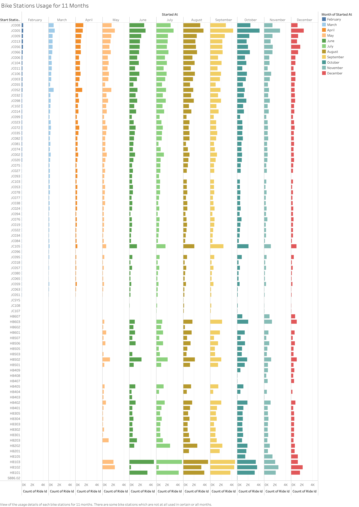
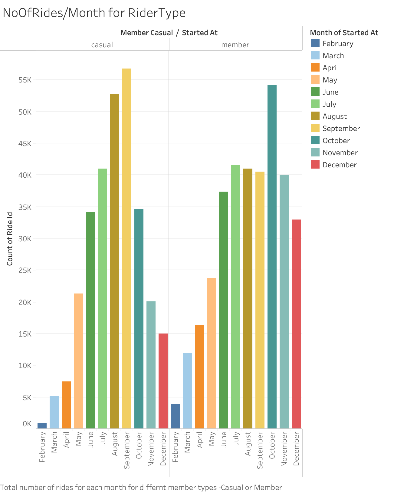
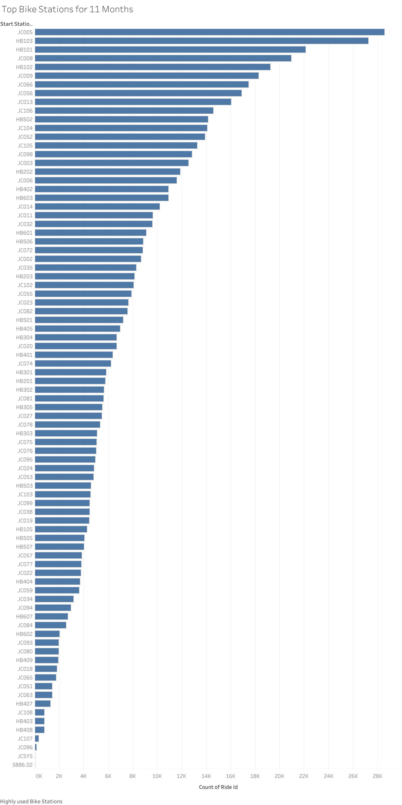
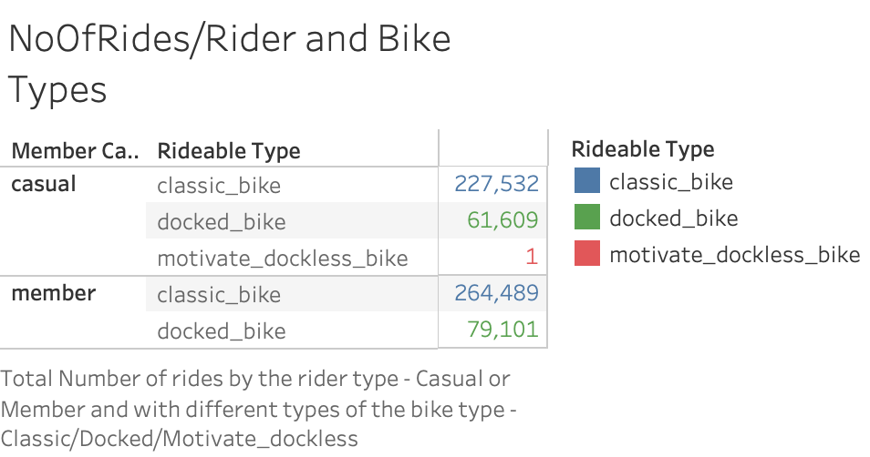
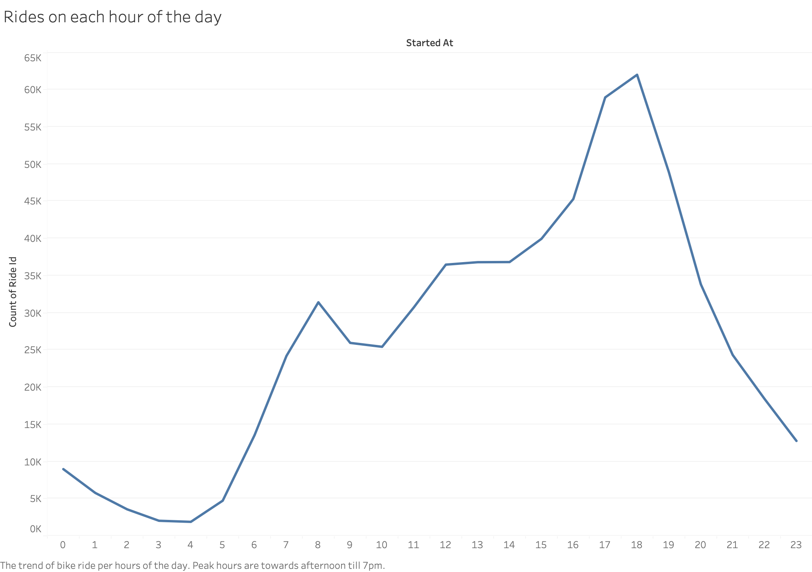
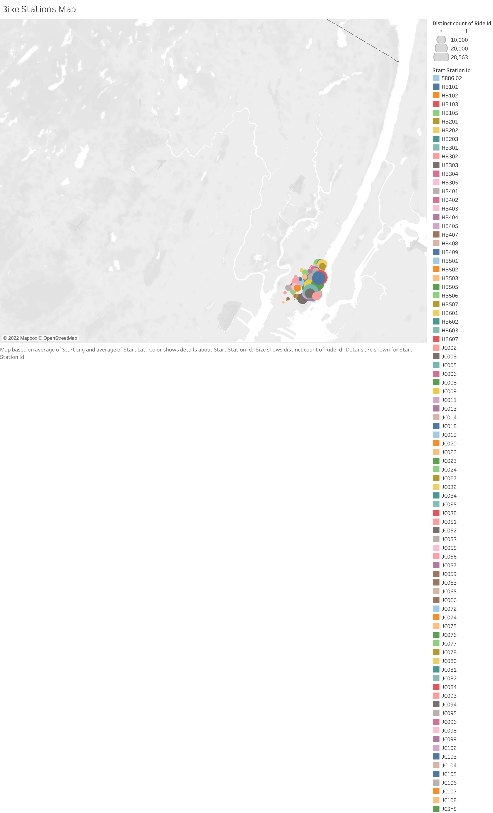

# Tableau_Challenge

[sharelink](https://public.tableau.com/views/CitiBikeTrip_16432563004230/NoOfRidesMonth?:language=en-US&:display_count=n&:origin=viz_share_link)

Citi Bike Data Visualization for 11 Months - Feb 2021 to December 2021 for Jersey city

## Data Source:
[Citi Bike Trip Data](https://s3.amazonaws.com/tripdata/index.html) 
Bike Trip Data for 11 months - Feb 2021 to December 2021 , as comma-separated values files are used.

## Tools used:
Tableau
Python (jupyter notebook)

## Data Preparation:
Data in the 11 .csv files is cleaned, by removing some fields which did not exist in some of the files. The .csv files were concatenated and a dataframe is generated. The dataframe is converted to a final .csv file to use in tableau.

The datavisualization of the analysis is published at:
[sharelink](https://public.tableau.com/views/CitiBikeTrip_16432563004230/NoOfRidesMonth?:language=en-US&:display_count=n&:origin=viz_share_link)

Analysis is done on:

Number of Trips in the Months
 

Bike usage by Casual or member bike rider type.

Top 10 highly used bike stations.

Highly used bike stations for each month.

Bike usage per Bike type.

Number of Trips for Peak hours

Map based on start time 

## Analysis and Conclusion
There is high usage of citi bike in Summer time, mainly in July, August, September. 
The usage decreases after September. 
The peak hours of usage are from 4 pm to 7 pm.
There are some bike stations which are not used at all.
